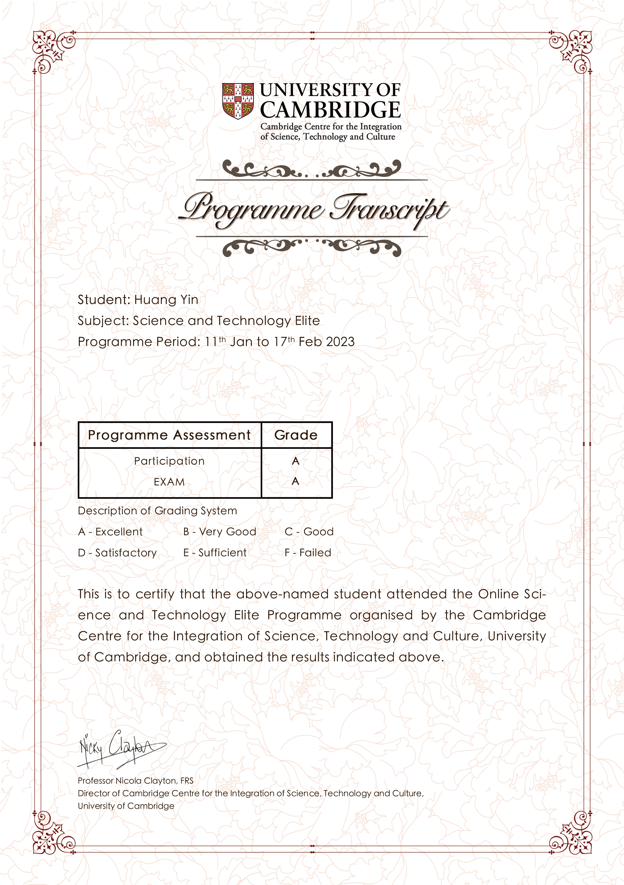
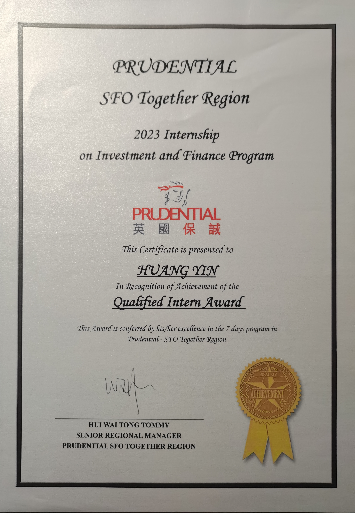
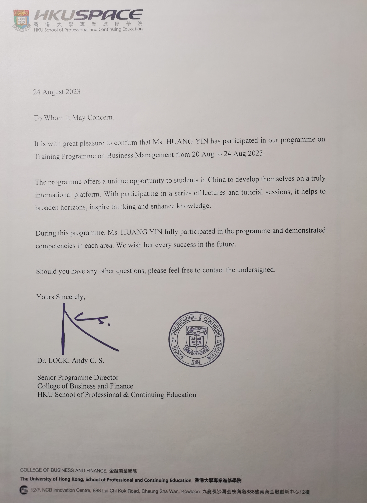








&emsp;I'm a fourth year undergraduate student from [School of Artificial Intelligence](https://sjxy.jhun.edu.cn/), [Jianghan University](https://www.jhun.edu.cn/). My research interest includes computer vision, machine/deep learning, data-centric AI and data mining.

&emsp;My CV:[HY's Curriculum Vitae](../assets/Curriculum_Vitae.pdf)  
&emsp;My Academic Transcript:[Transcript](../assets/Transcript.pdf)

# 📝 Publications 

**[2023 EEI]**[A new type of optical power meter based on silicon photovoltaic cells](https://ieeexplore.ieee.org/abstract/document/10212483)  
**Yin Huang**; Zhongyuan Lai; Hui Lan; Jinshan Sun  

**[2022 ICETCI]**[TGNN: Topic-aware Graph Neural Network for Identifying Fake News from Social Media](https://ieeexplore.ieee.org/document/9832149)  
Wang Gao; Mingyuan Ni; **Yin Huang**  

# 💻 Internship Experiences
- **Datang Internet Technology (Wuhan) Co., Ltd.**&emsp;&emsp;2023.06-2023.07  
&emsp;&emsp;-Data warehouse construction, data analysis based on big data components geared towards business data needs  
&emsp;&emsp;-Processed of data sets and model creation, training, and evaluation used the JAVA programming language

- **Taibao Technology Co., Ltd.**&emsp;&emsp;&emsp;2023.09-2023.11  
&emsp;&emsp;-Label and process raw data to train and evaluate AI product related algorithms, functionality and performance  
&emsp;&emsp;-Monitor, analyse, and manage AI product application data

# 📖 Projects Experiences
- **Fishing Circle**  
&emsp;&emsp;-Accomplished features like automatic oxygenation and feeding, environmental regulation, early warning, remote control of mobile phone APP, establishment of AI knowledge base to assist breeding, etc  
&emsp;&emsp;-As a project leader, provided overall co-ordination and planning for the project. Responsible for the underwater fish target identification component   
***Project results:***  
&emsp;&emsp;"Challenge Cup" Student Entrepreneurship Programme Competition&emsp;Bronze Award  
&emsp;&emsp;Internet+ College Students Innovation and Entrepreneurship Competition&emsp;Bronze Award  
&emsp;&emsp;[A utility model patent:Fishpond Farming Robot](../assets/patent.pdf)  

- **Sightpath - Driving Behaviour Detection and Analysis**  
&emsp;&emsp;-Designed a driving detection system to monitor whether drivers engage in illegal driving behaviors, including fatigue driving, making phone calls, drinking water, etc  
&emsp;&emsp;-In charge of model construction and testing to improve model accuracy  
***Project results:***   
&emsp;&emsp;China University Computer Design Competition&emsp;Third Prize  
&emsp;&emsp;[A software copyright:Sightpath - Driving Behavior Detection and Analysis Software System V1.0](../images/copyright.jpg)  

- **Autonomous driving, the future has arrived**  
&emsp;&emsp;-Collected 792 questionnaires and conducted statistical analysis on the data. Established a model to explore the factors that affect the willingness to use and pay of shared autonomous vehicle (SAV)  
&emsp;&emsp;-Responsible for model construction and text mining to determine the significant features of the SAV user group  
***Project results:***  
&emsp;&emsp;National Student Market Research and Analysis Competition&emsp;Third Prize  
&emsp;&emsp;[China National University Student Innovation & Entrepreneurship Development Program](../images/certificate.jpg)

# 🎖 Awards
- 2023&emsp;National Scholarship  
- 2022&emsp;Wuhan City Government Scholarship  
- 2022&emsp;The First Prize Scholarship of Jianghan University  
- 2021&2023&emsp;Outstanding Student Leader Scholarship of Jianghan University  

# 💬 External Exchange Programmes
- *2023.01-2023.02*&emsp;&emsp;Future Technology Elite Programme&emsp;&emsp;University of Cambridge  
&emsp;&emsp;-Established the ability to think about problems in multiple dimensions through professional lectures and interactive classes  
&emsp;&emsp;-Finally obtained project certificates and passed the exam  

- *2023.08*&emsp;&emsp;Future Elite Project&emsp;&emsp;University of Hong Kong  
&emsp;&emsp;-Studied courses at the University of Hong Kong, experienced the corporate culture of Prudential  
&emsp;&emsp;-Ultimately obtained project certificates and recommendation letters  

